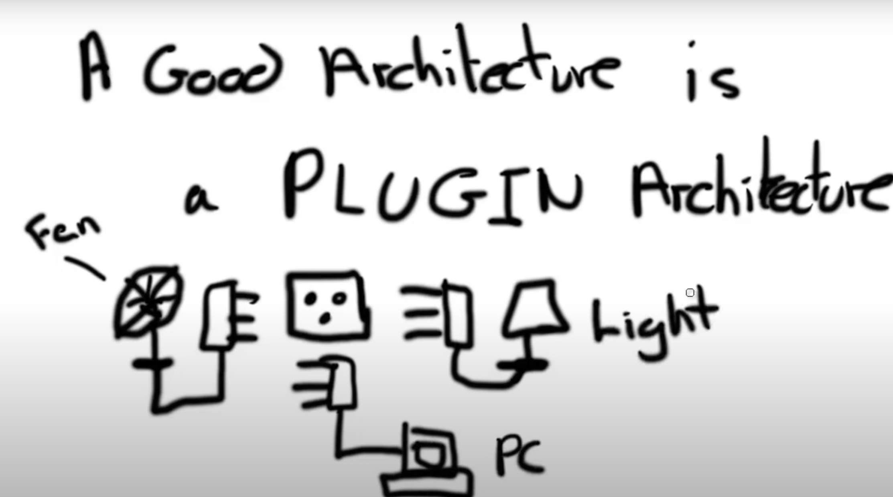
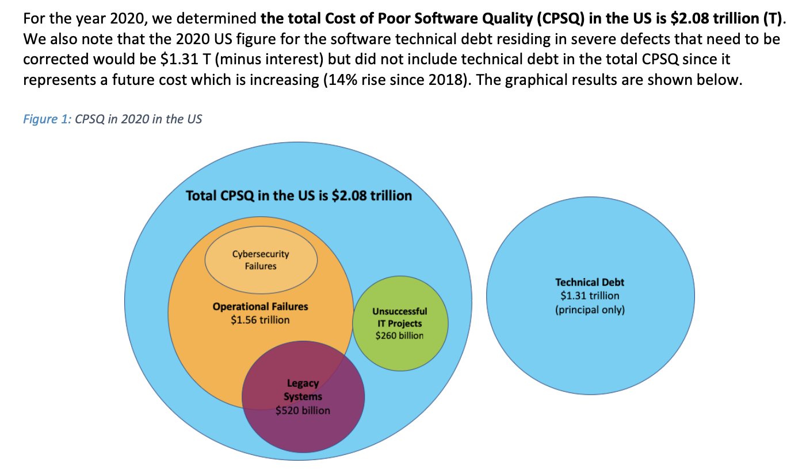

# The Value of Clean Code: Why It Matters More Than You Think

What if I told you that clean code is worth millions of dollars on a project level?  
What if I told you that clean code is worth billions of dollars on a company level?  
What if I told you that clean code is worth the entire market capitalization of Crypto on a national level?

These are not hypotheticals, but real-world consequences of bad coding practices which I will reveal to you today.

If there is one thing you remember from this conversation, it is this: **Clean coding is not just about aesthetics or pride; it has real, tangible benefits that are extremely valuable and, in my opinion, essential for a project and its contributors to thrive. Not taking these practices seriously can lead to massive frustration for contributors of a project, and even lead to the project's demise.

Even if a project is successful, the cost of sub-optimal design puts a ceiling on the complexity that the software can handle, which is also a loss of potential value.

---

## The Cost of Bad Coding Practices

### Economic Impact

Bad coding practices can have a significant economic impact on a project and an organization. Poorly written code can lead to increased maintenance costs, longer development cycles, and higher operational expenses. Even worse, security vulnerabilities and bugs introduced by bad code can result in data breaches, system failures, and legal liabilities, leading to substantial financial losses.

### Productivity Loss

Bad code doesn't just cost money; it also saps productivity. Developers spend a significant amount of time debugging and maintaining poorly written code, which detracts from their ability to develop new features and improve existing ones. This constant firefighting mode leads to decreased productivity and increased frustration among team members.

### Technical Debt

Technical debt refers to the future cost of reworking code that was implemented quickly to meet deadlines but is not sustainable in the long term. Technical debt can accumulate rapidly, making it increasingly difficult to add new features or fix bugs. Over time, this debt can become so overwhelming that it stifles innovation and progress.

---

### The Purpose and Goal of Software Development

"Keeping Software Soft" - Robert C. Martin (Uncle Bob)

The primary goal of software development is to build systems that effectively achieve their intended goals, are highly reliable, easy to change, and easy to maintain. This is "keeping software soft" refers to. The idea is to ensure that software remains robust and flexible to change, which is crucial in a world where requirements and technologies are constantly evolving.

---

### Paradigms of Software Development

There are three main paradigms of software development that emerged within the 10 years between 1958 and 1968. These paradigms have stood the test of time and are likely to be the only ones we ever see, as no new paradigms have emerged in the many decades since then. These are:

1. **Structured Programming**:
   - The understanding that certain uses of `goto` statements prevent functions from being decomposed led to `structured programming`, which uses simple selection and iteration control like `if/then/else` and `do/while`. Modules that only use these types of structures can be recursively decomposed into smaller modules.

2. **Object-Oriented Programming (OOP)**:
   - OOP encourages encapsulation, inheritance, and polymorphism.
     - **Encapsulation**: Bundling the data (attributes) and methods (functions) that operate on the data into a single unit or class and restricting direct access to some of the object's components, which means control is transferred through well-defined **interfaces**.
     - **Inheritance**: Allows a class to inherit properties and methods from another class. This means control can be transferred to methods defined in a parent class, promoting code reuse and reducing redundancy.
     - **Polymorphism**: Allows you to define a single interface or method in a base class and have multiple derived classes implement or override that method in different ways. The method that gets executed is determined at runtime based on the actual object type, not the reference type.
       - The power of polymorphism cannot be understated. It allows us to architect software using a **plugin architecture** and to invert the dependencies through **dependency inversion** (one of the SOLID principles). This means that we have the power to isolate the **business logic** and plug in the UI and database into it! The source code of the business logic never mentions the UI or database.

3. **Functional Programming**:
   - This paradigm enforces control on assignment by using immutable variables. "The variables in functional languages do not vary."
     - The reason for this restriction is that all race conditions, deadlock conditions, and concurrent update problems are due to mutable variables. When it comes to software design, this will save a lot of headaches and make the system more robust.

The insight with these paradigms is that each one of them **removes capabilities from the programmer**. These paradigms align well with code design: function, separation of components, and data management. While it feels that the software world is ever-changing, it is valuable to understand that the basic principles, which apply to any software language and system, have not changed in over 50 years.

---

### The Million-Dollar Mystery

What if I told you that clean code is worth millions of dollars on a project level? Here’s my personal experience: I once worked for a software company which hired a software shop which had a team of 30 people. We were working on a marketplace system, but the code was becoming an unmaintainable mess prone to lots of bugs. After two years and $2 million later, the project was scrapped due to poor coding practices and lack of maintainability. We dropped the development team and searched for a new one after I pleaded with the CEO at the time. A move that turned out to be very successful for the company. They were able to create a new project with a fraction of the manpower due to better coding practices and maintainability.

---

### The Principles of Clean Code

To achieve the goal of easy maintainability and changeability, we need to follow certain principles. These principles are:

1. **Meaningful Names**: Use descriptive names for variables, functions, and classes to convey their purpose clearly.
2. **Functions**: Keep functions small and focused on a single task. This makes them easier to understand, test, and maintain.
3. **Comments**: Use comments sparingly and only to explain why something is done, not what is done. The code itself should be self-explanatory.
4. **Error Handling**: Handle errors gracefully and ensure they are easy to understand. This helps in debugging and maintaining the code.
5. **DRY Principle**: Don’t Repeat Yourself; avoid code duplication to reduce the risk of inconsistencies and make maintenance easier.

#### Test-Driven Development (TDD)

Test-Driven Development (TDD) is a practice that involves writing tests before writing the code that makes the tests pass. The number one goal of TDD is readability, readability, readability.

This approach has several benefits:

- **Makes Code More Modular**: The testing environment forces developers to write modular code that is easier to test and maintain. This has the added benefit of making the code more reusable and scalable.
- **Improves Code Quality**: Writing tests first forces developers to think about the requirements and design before implementation, leading to better-structured code.
- **Ensures Better Test Coverage**: TDD ensures that all code is covered by tests, which helps in catching bugs early.
- **Facilitates Refactoring**: With a comprehensive suite of tests, developers can refactor code with confidence, knowing that any changes that break functionality will be caught by the tests.

In a TDD environment, the tests are considered as important as the production code. This requires building tooling and classes to help encapsulate testing logic and keep it clean, easy to read, and easy to maintain.

---

### The Billion-Dollar Blunder

A classic example of a company losing billions due to poor design and coding practices is the case of the Healthcare.gov website launch in 2013.

**Healthcare.gov Launch Failure**

- **Background**: Healthcare.gov is a health insurance exchange website created by the U.S. federal government under the Affordable Care Act (ACA). It was intended to provide a marketplace for Americans to compare and purchase health insurance plans.
- **Incident**: The website was launched on October 1, 2013, but it was plagued with severe technical issues from the outset, making it nearly unusable for millions of Americans trying to sign up for health insurance.
- **Details of the Poor Design**:
  - **Lack of Scalability**: The website was not designed to handle the high volume of traffic it received upon launch. It crashed repeatedly under the load.
  - **Integration Issues**: The system had to integrate with numerous other systems, including those of insurance companies and federal agencies. These integrations were poorly implemented, leading to data mismatches and errors.
  - **User Experience**: The user interface was confusing and difficult to navigate, leading to a poor user experience.
  - **Testing Deficiencies**: The website was not adequately tested before launch. Many critical issues were not identified and resolved in time.
  - **Project Management**: The project suffered from poor management, with unclear responsibilities and lack of coordination among the multiple contractors involved.
- **Consequences**:
  - The initial failure of Healthcare.gov was a major embarrassment for the U.S. government and the Obama administration.
  - The government had to bring in a team of experts to fix the issues, which took several months and cost hundreds of millions of dollars.
  - The total cost of developing and fixing Healthcare.gov is estimated to be around $2.1 billion.
  - The failure delayed the enrollment of millions of Americans in health insurance plans, causing significant public frustration and political fallout.
- **Lessons Learned**:
  - **Scalability**: Design systems to handle expected peak loads and ensure they can scale as needed.
  - **Integration Testing**: Thoroughly test integrations with external systems to ensure data consistency and reliability.
  - **User-Centered Design**: Focus on creating a user-friendly interface and experience.
  - **Comprehensive Testing**: Conduct extensive testing, including load testing, to identify and fix issues before launch.
  - **Effective Project Management**: Ensure clear responsibilities, coordination, and communication among all stakeholders and contractors.

---

### SOLID Principles

The SOLID principles are a set of design principles that help developers create more maintainable and scalable software. These principles are:

1. **Single Responsibility Principle (SRP)**: A class should have only one reason to change, meaning it should have only one job or responsibility.
2. **Open/Closed Principle (OCP)**: Software entities should be open for extension but closed for modification.
3. **Liskov Substitution Principle (LSP)**: Objects of a superclass should be replaceable with objects of a subclass without affecting the correctness of the program.
4. **Interface Segregation Principle (ISP)**: Clients should not be forced to depend on interfaces they do not use.
5. **Dependency Inversion Principle (DIP)**: High-level modules should not depend on low-level modules. Both should depend on abstractions.

### SOLD Principles: SOLID Simplified

1. **(SRP) == (ISP)**: These two are similar and primarily focused on breaking things down into modular pieces which can be more easily tested AND composed together into a more complex and maintanable system.
2. **Open/Closed Principle (OCP)**: This principle ensures updates are backwards compatible
3. **Liskov Substitution Principle (LSP)**: Ensures system stability by being able to swap out components which implement the same interface without breaking the system.
4. **Dependency Inversion Principle (DIP)**: With OOP, we can direct the flow of control by inverting the dependencies. This is a powerful concept that allows us to isolate the business logic from the UI and database.

---

### A Note On Architecture

The real beauty of following clean coding principles and practices is the ability to isolate the primary logic of the system (center) from the "details" that are in constant evolution (UI, database, etc.). 

Ultimately this can be boiled down to building systems with a plugin architecture.

In this image, the outlet represents an interface. All of the electronics which want to use the interface, need to implement the proper plug and power requirements. This is the same concept in software. The business logic is the outlet, and the UI and database are the electronics. The business logic doesn't care what the UI or database is, it just needs to know that it can plug into it.

---

### The Importance of Continuous Learning and Communication

Continuous learning and effective communication are crucial for maintaining high coding standards. The software development field is constantly evolving, and staying up-to-date with the latest practices, tools, and technologies is essential. Regular team discussions, code reviews, and knowledge-sharing sessions can help ensure that everyone is on the same page and committed to maintaining clean code.

---

### The Trillion-Dollar Truth

What if I told you that clean code is worth trillions of dollars? According to the CPSQ-2020 report, the total cost of poor software quality in the US is estimated to be around $2.08 trillion. This staggering amount is greater than the market capitalization of the entire crypto market at the start of 2024, which was $1.64 trillion. The financial impact of poor coding practices is immense.

---

### Conclusion

In conclusion, clean coding practices are not just about aesthetics or pride; they have real, tangible benefits that are extremely valuable and essential for a project's success. By following the paradigms of software development, adhering to the SOLID principles, and implementing the principles of clean code, we can create software that is maintainable, scalable, and reliable.

The financial and operational impacts of poor coding practices are significant, as highlighted by the CPSQ-2020 report. By adopting clean coding practices, we can avoid these pitfalls and ensure the success and longevity of our software projects.

So, can you afford not to invest in clean code? Share your experiences and thoughts on clean coding. 

Let's strive for excellence together.
