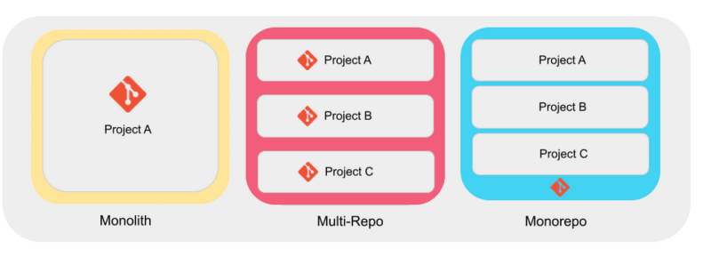
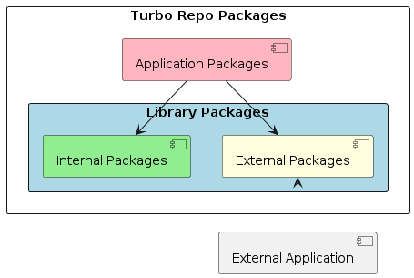
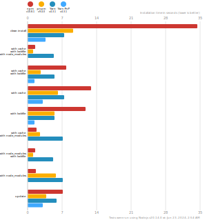
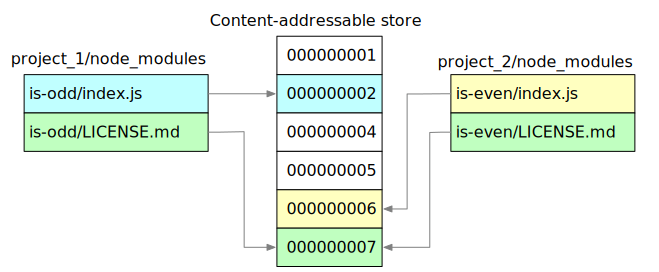

## Introduction: Unraveling the Modular Mystery
When you hear "monorepo", you might be thinking, "A single repository for all projects? Wouldn't that lead to a tangled mess?" And you wouldn't be alone in that initial reaction. But here's where it gets interesting: what if I told you that this approach actually leads to more modular, flexible, and efficient code?

This is the unexpected reality that tech giants like Google, Uber, and reportedly even Meta (formerly Facebook) have discovered. Google, for instance, keeps a staggering 95% of their codebase in a single repository, with each project retaining its independence. Uber transformed their Android development with a monorepo approach, reaping benefits that we'll explore later.

<div style={{ display: 'flex', justifyContent: 'center' }}>
  
</div>

But the real mystery lies in how these massive, all-encompassing repositories paradoxically foster modularity and improve software effectiveness. It's a puzzle that challenges our assumptions about code organization and collaboration.

So, why are these tech giants choosing monorepos? How does bringing multiple projects under one repository roof lead to better separation of concerns and increased modularity? And most intriguingly, could this approach be the key to unlocking new levels of efficiency and collaboration in your own development projects?

In this post, we'll unravel this mystery and explore the world of monorepos. We'll dive into their benefits, tackle their challenges head-on, and reveal how they can significantly enhance your software development effectiveness.

Let's uncover the secrets that have led tech giants to embrace the monorepo revolution, all while maintaining – and even enhancing – the modularity of their code.

## Understanding Monorepos

Before we dive into the benefits, let's clarify what exactly a monorepo is and how it differs from traditional multi-repository setups.

A monorepo, short for monolithic repository, is a version control strategy where multiple projects or components are stored in a single repository. This approach contrasts with the more traditional multi-repo setup, where each project or component has its own separate repository.



In a multi-repo setup, you might have separate repositories for your frontend, backend, shared libraries, and documentation. Each of these would be managed independently, with its own version control history, issue tracking, and release cycles.

A monorepo, on the other hand, brings all of these components under one roof. Using Turborepo architecture, your directory structure might look something like this:

```
my-monorepo/
├── apps/
│   ├── web/
│   │   ├── package.json
│   │   └── ...
│   └── api/
│       ├── package.json
│       └── ...
├── contracts/
│   └── solidity/
│       ├── package.json
│       └── ...
├── packages/
│   ├── ui/
│   │   ├── package.json
│   │   └── ...
│   └── utils/
│       ├── package.json
│       └── ...
├── package.json
└── turbo.json
```

Key points to understand about this structure:

1. **Independent Packages**: Each project or package has its own `package.json` file, allowing it to manage its dependencies independently.
2. **Shared Resources**: While packages are independent, they can easily share and reuse code from other packages within the monorepo.
3. **Workspace Management**: Tools like Turborepo and PNPM workspaces allow for efficient management of these multiple packages.
4. **Centralized Configuration**: The root `package.json` and `turbo.json` files allow for centralized configuration and script definitions.

## Real-World Benefits: How Monorepos Transform Development Teams

<div style={{ display: 'flex', justifyContent: 'center' }}>
   
</div>

When teams adopt a monorepo structure, especially one powered by Turborepo, they often experience a seismic shift in their development processes. Let's dive into the transformative benefits that make monorepos a game-changer for many organizations.

### Lightning-Fast Onboarding

Imagine a new developer joining your team. In a traditional multi-repo setup, they might spend days, if not weeks, getting their environment set up, cloning multiple repositories, and figuring out how different parts of the system interact. With a monorepo, this process is dramatically simplified. One clone, and they have access to the entire codebase. The standardized setup across all projects means they can hit the ground running, contributing meaningful code within days rather than weeks.

### Enforcing Code Quality and Consistency

Monorepos are a powerful tool for enforcing code quality and consistency. With shared configurations for tools like ESLint, Prettier, and TypeScript, gone are the days of debates over code style or formatting. These standards are automatically enforced across all projects, leading to a more uniform, maintainable codebase.

### Breaking Down Silos

Perhaps one of the most significant advantages is how monorepos break down the silos between frontend and backend teams. In a world where full-stack development is increasingly valuable, monorepos naturally encourage developers to explore beyond their comfort zones. A frontend developer might find themselves exploring backend code to understand an API, while a backend developer might delve into the frontend to see how their endpoints are being used. This cross-pollination of knowledge leads to more robust, thoughtfully designed systems.

### Embracing DRY Principles

The principle of Don't Repeat Yourself (DRY) becomes much easier to adhere to in a monorepo setup. Shared packages for common functionality become the norm rather than the exception. Need a utility function? It's probably already there, ready to be imported. This not only reduces code duplication but also makes refactoring a breeze. When you need to update a shared piece of functionality, you can do so in one place and see the effects ripple through your entire system.

### Simplified Dependency Management

Managing dependencies in a large, multi-project system can be a nightmare. But in a monorepo, it becomes significantly more manageable. With tools like PNPM and Turborepo, you can ensure consistent versions of dependencies across all your projects. Updating a shared dependency becomes a single operation rather than a coordinated effort across multiple repositories.

### Streamlined Releases and Versioning

When it comes to releases and versioning, monorepos shine. Tools like Changesets allow for coordinated releases across multiple packages. Automated changelog generation means your documentation always stays up-to-date with your code. This level of coordination is difficult, if not impossible, to achieve with traditional multi-repo setups.

### Turbocharging Build Performance

Build performance is another area where monorepos, especially those using Turborepo, excel. The intelligent caching and parallel execution capabilities mean your builds are often significantly faster. Only rebuilding what has changed saves precious time in CI/CD pipelines, leading to faster feedback loops and more frequent deployments.

### Fostering Unified Team Knowledge

Perhaps most importantly, monorepos foster a sense of unified team knowledge. When the entire codebase is accessible to everyone, it promotes a holistic understanding of the system. Knowledge sharing becomes easier, and cross-training between frontend and backend teams happens organically. This leads to a more versatile, adaptable team that can tackle challenges more effectively.


## Case Study: Uber's Journey to Android Monorepo


[Uber's transition to a monorepo](https://www.uber.com/en-CA/blog/android-engineering-code-monorepo/) for their Android codebase offers a compelling real-world example of how monorepos can significantly improve a development team's workflow.

#### Background
Uber started with a single repository for their Android rider app in 2010. As the company grew, they transitioned to a multi-repo structure in 2013-2014 to address issues like long build times and feature coupling. However, by 2016, this multi-repo setup began to reach its limits.

#### Challenges with Multi-Repo
1. **Architecture Silos**: Different teams were using a variety of patterns and architectures, leading to a steep and consistent learning curve for developers working across libraries.
2. **Dependency Hell**: As the dependency graph grew in complexity, managing and updating dependencies became increasingly time-consuming and error-prone.
3. **Long Build Times**: Fresh app builds could take over 15 minutes, significantly hampering developer productivity.

#### The Monorepo Solution
In 2016, Uber decided to invest in a monorepo structure. This decision allowed them to:

1. **Improve IDE Support**: They optimized IntelliJ for their large codebase, enhancing developer experience.
2. **Reduce Build Times**: By switching from Gradle to Buck (a modular build system), they reduced fresh build times from 15+ minutes to under 5 minutes, and incremental builds to under 1 minute.
3. **Maintain a Clean Master Branch**: They introduced a "Submit Queue" system that rebases changes and runs tests before merging, preventing broken builds.

#### Results
The transition to a monorepo, coupled with investments in tooling, led to significant improvements:
- **Faster Builds**: Build times were reduced by over 66% for fresh builds and even more for incremental builds.
- **Improved Code Quality**: The Submit Queue system helped maintain a consistently stable master branch.
- **Enhanced Developer Productivity**: With faster builds and better tooling, developers could iterate more quickly and efficiently.
- **Scalability**: The monorepo structure, supported by custom tooling, allowed Uber to continue scaling their Android development as the company grew.

#### Key Takeaway
Uber's experience demonstrates that while transitioning to a monorepo requires significant investment in tooling and infrastructure, it can lead to substantial improvements in developer productivity and code quality, especially for large, rapidly growing codebases.


## Package Structure in Turbo Repos

In a Turborepo, packages are organized in a way that maximizes reusability and maintainability. Let's break down the package structure:

<div style={{ display: 'flex', justifyContent: 'center' }}>
   
</div>

### Types of Packages

#### Application Packages
   - These are the end-user applications in your monorepo.
   - They can depend on both Internal and External Library Packages.
   - Examples: Web applications, mobile apps, or backend services.

#### Library Packages
   These are further divided into two categories:

**Internal Packages**
      - Used only within the Turborepo.
      - Not published to npm or other package registries.
      - Provide shared functionality across your applications.
      - Examples: Shared UI components, utility functions, or internal business logic.

**External Packages**
      - Can be used both within the Turborepo and by external applications.
      - Typically published to npm or other package registries.
      - Provide functionality that can be useful beyond your specific project.
      - Examples: Open-source libraries, SDKs, or API clients.

### Package Relationships

- **Application Packages** can depend on both Internal and External Library Packages.
  This allows your applications to leverage shared code efficiently.

- **External Applications** (outside your Turborepo) can only use your External Packages.
  This maintains a clear boundary between your internal code and what you expose to the outside world.

## Tools that Power Monorepo Efficiency

The true power of a monorepo is unleashed when combined with specialized tools designed to optimize workflows. Let's explore the key tools that supercharge monorepo efficiency in a Turborepo setup: Turborepo itself, Changesets, and PNPM.

### [Turborepo](https://turbo.build/repo): The Core of Monorepo Optimization

Turborepo is a high-performance build system designed specifically for JavaScript and TypeScript monorepos.

Key features:

1. **Intelligent Caching**: Turborepo caches task outputs, dramatically speeding up subsequent builds by only rebuilding what's changed.
2. **Parallel Execution**: It runs tasks across multiple packages in parallel, significantly reducing overall build time.
3. **Remote Caching**: Share build caches across your team or CI/CD pipeline to further optimize build times.
4. **Task Pipeline**: Define dependencies between tasks across your entire monorepo.

Example `turbo.json`:

```json
{
  "$schema": "https://turborepo.org/schema.json",
  "pipeline": {
    "build": {
      "dependsOn": ["^build"],
      "outputs": ["dist/**", ".next/**"]
    },
    "test": {
      "dependsOn": ["build"],
      "outputs": []
    },
    "lint": {
      "outputs": []
    },
    "deploy": {
      "dependsOn": ["build", "test", "lint"]
    }
  }
}
```

### [Changesets](https://github.com/changesets/changesets): Streamlining Versioning and Changelogs

Changesets is a tool for managing versions and changelogs in a monorepo setup, which integrates seamlessly with Turborepo.

Key features:

1. **Version Management**: Easily bump versions of packages that have changed.
2. **Changelog Generation**: Automatically generate and update changelogs.
3. **Release Management**: Streamline the process of publishing packages.

### [PNPM](https://pnpm.io/): Efficient Package Management

PNPM (Performant NPM) is a fast, disk-space efficient package manager that's particularly well-suited for Turborepos.

<div style={{ display: 'flex', justifyContent: 'center' }}>
   
</div>

Key features:

1. **Content-Addressable Storage**: PNPM stores all packages in a single place on your disk and uses hard links to add them to your `node_modules` folders.

<div style={{ display: 'flex', justifyContent: 'center' }}>
   
</div>

2. **Strict Mode**: Ensures that your projects only access the dependencies they've explicitly declared.
3. **Workspaces**: Easily manage multiple packages in your monorepo, enabling local package linking without complex setup.

## Streamlined CI/CD and Containerization

A well-structured monorepo, especially one using Turborepo, can significantly enhance your Continuous Integration and Continuous Deployment (CI/CD) processes. Furthermore, it integrates seamlessly with containerization technologies like Docker.

### [CI/CD in a Turborepo](https://turbo.build/repo/docs/guides/ci-vendors/github-actions)

Turborepo's architecture lends itself well to efficient CI/CD pipelines. Here's how:

1. **Incremental Builds**: Turborepo only rebuilds what has changed, significantly speeding up CI processes.
2. **Parallel Execution**: Tasks across multiple packages can run in parallel, reducing overall build time.
3. **Caching**: Turborepo's caching mechanism can be leveraged in CI environments to speed up subsequent builds.

### [Docker in a Turborepo](https://turbo.build/repo/docs/guides/tools/docker)

Turborepo works well with Docker, allowing you to containerize your applications efficiently.

1. **Individual Dockerfiles**: Each application in your `apps/` directory can have its own Dockerfile.
2. **Docker Compose**: At the root of your Turborepo, you can use Docker Compose to define and run multi-container applications.

```Docker
version: "3"

services:
  web:
    container_name: web
    build:
      context: .
      dockerfile: ./apps/web/Dockerfile
    restart: always
    ports:
      - 3000:3000
    networks:
      - app_network
  api:
    container_name: api
    build:
      context: .
      dockerfile: ./apps/api/Dockerfile
    restart: always
    ports:
      - "${API_PORT:-3001}:${API_PORT:-3001}" # Use API_PORT environment variable or default to 3001
    environment:
      - PORT=${API_PORT:-3001} # Set container PORT env to API_PORT environment variable or default to 3001
    networks:
      - app_network

# Define a network, which allows containers to communicate
# with each other, by using their container name as a hostname
networks:
  app_network:
    # external: true # Set to true if network is already created

```

## Navigating the Challenges of Monorepo Architecture

<div style={{ display: 'flex', justifyContent: 'center' }}>
   
</div>

While monorepos offer a wealth of benefits, they're not without their hurdles. Like any significant architectural decision, adopting a monorepo comes with its own set of challenges. Let's explore these challenges and discuss strategies to overcome them.

### Taming the Initial Setup Beast

Setting up a monorepo, especially with tools like Turborepo, can feel like a daunting task. It requires careful planning and can be time-consuming. But don't let this intimidate you. Start with a clear architecture plan and consider using existing Turborepo templates as a starting point. Remember, Rome wasn't built in a day – implement your setup incrementally, starting with a few key projects and expanding from there.

### The Build Time Balancing Act

With numerous projects in one repo, build times can start to feel like you're waiting for paint to dry. This is where Turborepo really shines. Leverage its caching capabilities to their fullest – you'll be amazed at how much time you can save. Implement incremental builds so you're only rebuilding what's changed. For an extra boost, use remote caching in your CI/CD pipelines to share build artifacts across runs.


### Versioning and Releases: A Coordinated Effort

Coordinating versions and releases across multiple packages can feel like herding cats. Tools like Changesets can be your secret weapon here, helping manage versions and generate changelogs automatically. Implement clear versioning policies (semantic versioning is a good start) and automate your release process as much as possible. Your future self will thank you.

### Taming the CI/CD Beast

CI/CD pipelines for monorepos can quickly become complex and slow. Turborepo's pipeline feature is a lifesaver here, helping you define efficient build processes. Implement intelligent CI that only runs tests for affected packages – no need to test everything every time. And don't forget to leverage caching in your CI/CD to speed up those builds.

### Overcoming Team Resistance

Change can be scary, and some team members may resist the switch to a monorepo structure. Clear communication is crucial here. Explain the benefits of monorepo architecture and provide comprehensive training and support during the transition. Consider starting with a pilot project to demonstrate the benefits before going all-in.

### When Your Tools Don't Play Nice

Not all development tools are optimized for monorepo structures, which can lead to some headaches. When choosing tools, look for those that explicitly support monorepos (like Turborepo, PNPM, and Changesets). Don't be afraid to contribute to open-source projects to improve monorepo support. And sometimes, you might need to develop custom scripts or tools to fill in the gaps.


## Conclusion: Embracing the Power of Monorepos with Turborepo

As we've explored throughout this post, monorepos, especially when powered by tools like Turborepo, offer a compelling approach to managing complex software projects. They bring all your projects under one roof, fostering collaboration and code reuse. Tools like Turborepo, PNPM, and Changesets streamline builds, dependency management, and releases, leading to improved code quality and simplified workflows.

While monorepos present unique challenges, most can be effectively mitigated with proper planning and tooling. As tools like Turborepo continue to evolve, we can expect monorepo development to become even more powerful and accessible.

Adopting a monorepo structure with Turborepo is not just about changing your repository structure—it's about embracing a philosophy of unified, efficient development. Whether you're a small startup or a large enterprise, if you're looking to streamline your development processes, improve code reuse, and foster better collaboration among your teams, it's worth seriously considering a monorepo approach with Turborepo.

The future of software development is collaborative, efficient, and integrated—and monorepos are leading the way. By embracing this approach and leveraging powerful tools like Turborepo, you're not just changing how you store your code; you're transforming how your team works together to build amazing software.